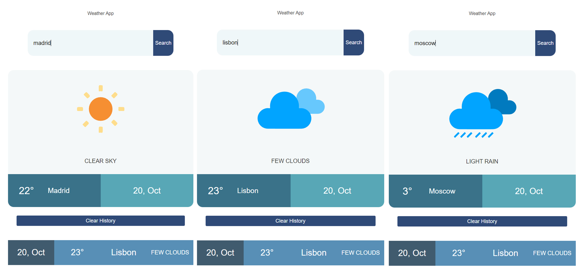
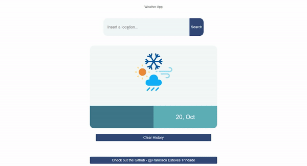
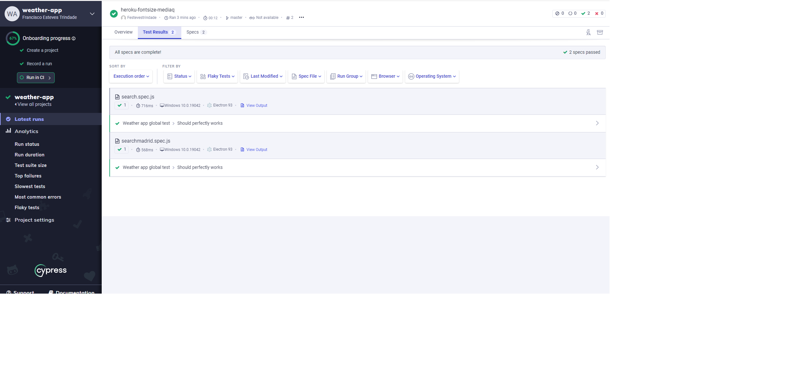

## Weather App

> Simple JavaScript weather app based on the OpenWeatherMap API.



## Live Demo




[Weather App - Demo](https://thisisawetherapp.herokuapp.com/)

## Built With

- HTML5
- CSS3
- JavaScript 
- Cypress for testing
- Herokuapp for deployment

## Usage

### Prerequisites

- node
- npm
- git

### Getting started

Clone the repository to your local machine

```
$ git clone https://github.com/Festevestrindade/weatherapp.git
```

Change into the project directory

```
$ cd weatherapp
```

Install dependencies

```
$ npm install
```

Start development server

```
$ npm start

```
Now open your browser and visit: localhost:3000 or simply click here: 

[localhost:3000](http://localhost:3000/)

### Run tests in Cypress

```
$ npm run cy:open
```

### Connect yourself to the Cypress Dashboard

```
$ npx cypress run --record --key -insertkeyhere
```



## Author

**Francisco Esteves Trindade**

- GitHub: [@FestevesTrindade](https://github.com/Festevestrindade)
- Email: [festevestrindaded@gmail.com](mailto:festevestrindaded@gmail.com)

## Contributing

Contributions, issues, and feature requests are welcome!
Feel free to check the [issues page](https://github.com/Festevestrindade/weatherapp/issues/).

1. Fork it
2. Create your working branch

```
git checkout -b my-new-feature
```

3. Commit your changes

```
git commit -am 'Add some feature'
```

4. Push to the branch

```
git push origin my-new-feature
```

5. Create a new Pull Request

## Show your support

Give a ⭐️ if you like this project!
